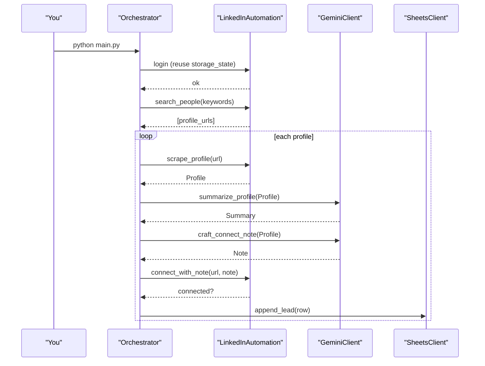

## Architecture

### Components
- `automation/config.py`: reads env, builds `Settings`
- `automation/linkedin.py`: Playwright login/session, search, scrape, connect
- `automation/gemini_client.py`: summaries + connection notes
- `automation/scoring.py`: popularity score
- `automation/sheets.py`: Google Sheets append
- `automation/orchestrator.py`: orchestrates the flow

### Data flow
1. Load `.env` and environment variables
2. Start LinkedInAutomation (reuse storage state if present)
3. Search people → collect profile URLs
4. For each URL: scrape → score → summarize → craft note
5. Attempt connect with note
6. Append result row to Google Sheet

### Sequence

### Storage state
- Reuses Playwright `storage_state.json` to avoid re-login
- Saved after successful login

### Notes
- LinkedIn DOM changes; locators may need updates
- Add throttling/random delays if extending volume

